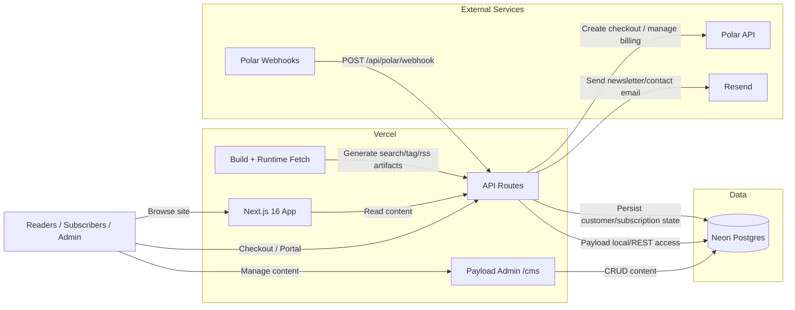

# Hypeburner High-Level Architecture

## Notes

- `Next.js` serves the public pages and the `Payload` admin panel on `/cms`.
- `Payload` uses `Neon Postgres` as the primary content + app data store.
- `Polar` powers checkout, customer portal, and subscription lifecycle webhooks.
- `Resend` handles outbound transactional/email flows.
